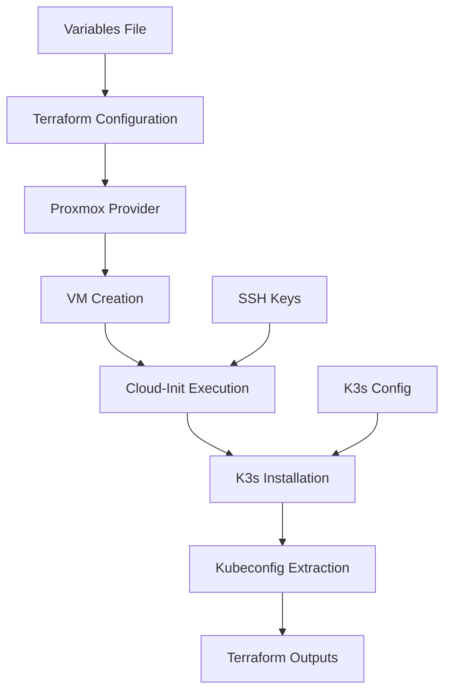

# Design Document

## Overview

This design implements a Terraform-based solution for deploying virtual machines in Proxmox and automatically installing K3s Kubernetes. The solution uses the Telmate Proxmox provider for VM provisioning and cloud-init for automated K3s installation, providing a fully automated path from infrastructure provisioning to ready-to-use Kubernetes cluster.

## Architecture



The architecture follows a linear provisioning flow where each component depends on the successful completion of the previous step. Terraform manages the entire lifecycle from VM creation through K3s deployment.

## Components and Interfaces

### Terraform Provider Configuration
- **Proxmox Provider**: Uses `telmate/proxmox` provider for VM management
- **Authentication**: Supports API token or username/password authentication
- **Connection**: Configurable Proxmox endpoint and TLS verification settings

### VM Resource Definition
- **Base Template**: Uses existing cloud-init enabled template (Ubuntu 22.04 LTS recommended)
- **Resource Allocation**: Configurable CPU cores, memory, and disk size
- **Network Configuration**: Bridge network with static IP or DHCP assignment
- **Storage**: Configurable storage pool and disk type (local-lvm, ceph, etc.)

### Cloud-Init Configuration
- **User Data**: Embedded script for K3s installation and configuration
- **SSH Keys**: Public key injection for secure access
- **Network Setup**: Static IP configuration if required
- **Package Updates**: System updates and prerequisite package installation

### K3s Installation Module
- **Installation Method**: Uses official K3s installation script via curl
- **Configuration Options**: Server mode with embedded etcd for single-node clusters
- **Security**: Configurable token for cluster authentication
- **Networking**: Flannel CNI with default pod and service CIDR ranges

### Output Management
- **VM Information**: IP address, hostname, and connection details
- **Kubeconfig**: Extracted and formatted for immediate use
- **Cluster Status**: Health check results and service endpoints

## Data Models

### Variable Schema
```hcl
variable "proxmox_config" {
  type = object({
    endpoint = string
    username = string
    password = string
    node     = string
  })
  description = "Proxmox connection configuration"
}

variable "vm_config" {
  type = object({
    name        = string
    template    = string
    cores       = number
    memory      = number
    disk_size   = string
    storage     = string
    network     = string
  })
  description = "VM resource configuration"
}

variable "k3s_config" {
  type = object({
    version     = string
    token       = string
    node_name   = string
    disable     = list(string)
  })
  description = "K3s installation configuration"
}
```

### Resource State
- **VM Resource**: Tracks Proxmox VM ID, IP assignment, and provisioning status
- **Cloud-Init Status**: Monitors initialization completion and script execution
- **K3s Cluster State**: Validates cluster readiness and node registration

## Error Handling

### Proxmox Connection Errors
- **Authentication Failures**: Clear error messages for invalid credentials
- **Network Issues**: Timeout handling and retry mechanisms
- **Resource Constraints**: Validation of available resources before provisioning

### VM Provisioning Errors
- **Template Issues**: Validation of base template existence and compatibility
- **Resource Allocation**: Pre-flight checks for CPU, memory, and storage availability
- **Network Configuration**: IP conflict detection and resolution

### K3s Installation Errors
- **Download Failures**: Retry logic for installation script retrieval
- **System Requirements**: Validation of OS compatibility and prerequisites
- **Service Startup**: Health checks and automatic restart mechanisms

### Recovery Mechanisms
- **Partial Failures**: Ability to continue from last successful step
- **State Corruption**: Import existing resources into Terraform state
- **Manual Intervention**: Clear documentation for manual recovery procedures

## Testing Strategy

### Unit Testing
- **Variable Validation**: Test input validation and type checking
- **Template Rendering**: Verify cloud-init script generation
- **Output Formatting**: Validate kubeconfig and connection string formats

### Integration Testing
- **Provider Connectivity**: Test Proxmox API authentication and basic operations
- **VM Lifecycle**: Create, modify, and destroy VM operations
- **Network Connectivity**: Verify VM network access and SSH connectivity

### End-to-End Testing
- **Full Deployment**: Complete workflow from terraform apply to working cluster
- **Cluster Validation**: Deploy test workloads and verify functionality
- **Cleanup Testing**: Ensure proper resource cleanup with terraform destroy

### Performance Testing
- **Provisioning Time**: Measure time from start to ready cluster
- **Resource Usage**: Monitor Proxmox host resource consumption
- **Scalability**: Test multiple concurrent VM deployments

## Security Considerations

### Authentication and Authorization
- **Proxmox Access**: Least-privilege API user with VM management permissions
- **SSH Key Management**: Secure key generation and distribution
- **K3s Security**: Token-based authentication and RBAC configuration

### Network Security
- **Firewall Rules**: Minimal required port exposure (6443 for Kubernetes API)
- **TLS Configuration**: Proper certificate management for cluster communication
- **Network Isolation**: VLAN or subnet isolation options

### Secrets Management
- **Sensitive Variables**: Use of Terraform sensitive variables for passwords and tokens
- **State File Security**: Recommendations for secure state storage (remote backend)
- **Kubeconfig Protection**: Secure handling of cluster access credentials

## Deployment Architecture

### Directory Structure
```
infra/terraform/proxmox-k3s/
├── main.tf              # Main resource definitions
├── variables.tf         # Input variable declarations
├── outputs.tf           # Output value definitions
├── versions.tf          # Provider version constraints
├── terraform.tfvars     # Environment-specific values
├── cloud-init.yaml      # Cloud-init configuration template
└── README.md           # Usage documentation
```

### Module Organization
- **Root Module**: Main VM and K3s configuration
- **Submodules**: Reusable components for different cluster types
- **Examples**: Sample configurations for common use cases

### State Management
- **Local State**: Development and testing environments
- **Remote State**: Production deployments with state locking
- **Backup Strategy**: Regular state file backups and recovery procedures